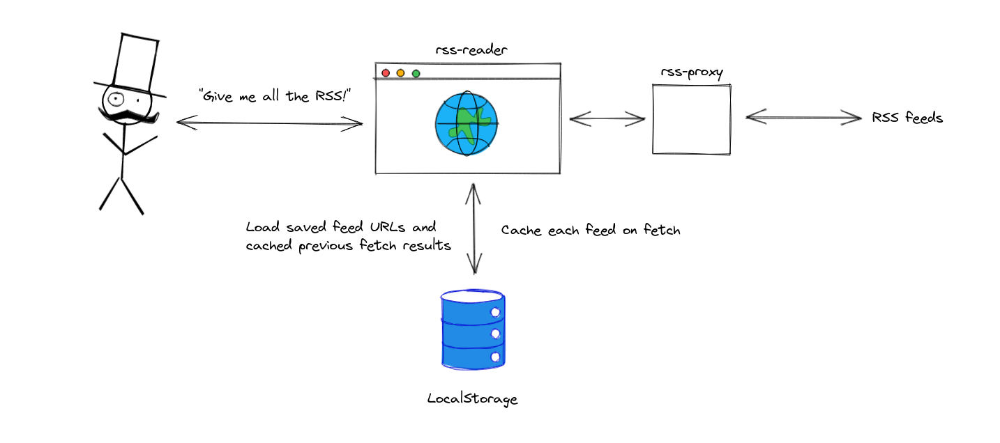

# Yet Another RSS Reader (YARR) :pirate_flag:

## Overview

In a never-ending DIY quest, I've put together this RSS feed reader to keep up with the news. The main requirement
observed here is to _not_ require any sort of backend (except for a serverless proxy to get around CORS) and to keep it
all as simple as possible.

The reader allows the user to provide RSS feed URLs that should be pulled, settings and fetched results are cached using
[browser local storage](https://developer.mozilla.org/en-US/docs/Web/API/Window/localStorage) if it's available. The
results caching is also used to prevent refetches on load if the cache is fresh enough.

The whole thing runs on [Netlify](https://www.netlify.com/)'s generous free tier.

Feel free to use it for your own RSS needs and to [drop a word or
two](https://github.com/mcataford/rss-reader/discussions/10) if you do. :tada:

## Contributing

The project welcomes contributions as long as they fit within the general roadmap, which is still TBD. Any contribution
making the bundle smaller will be eagerly reviewed and celebrated as long as it preserves functionality.
